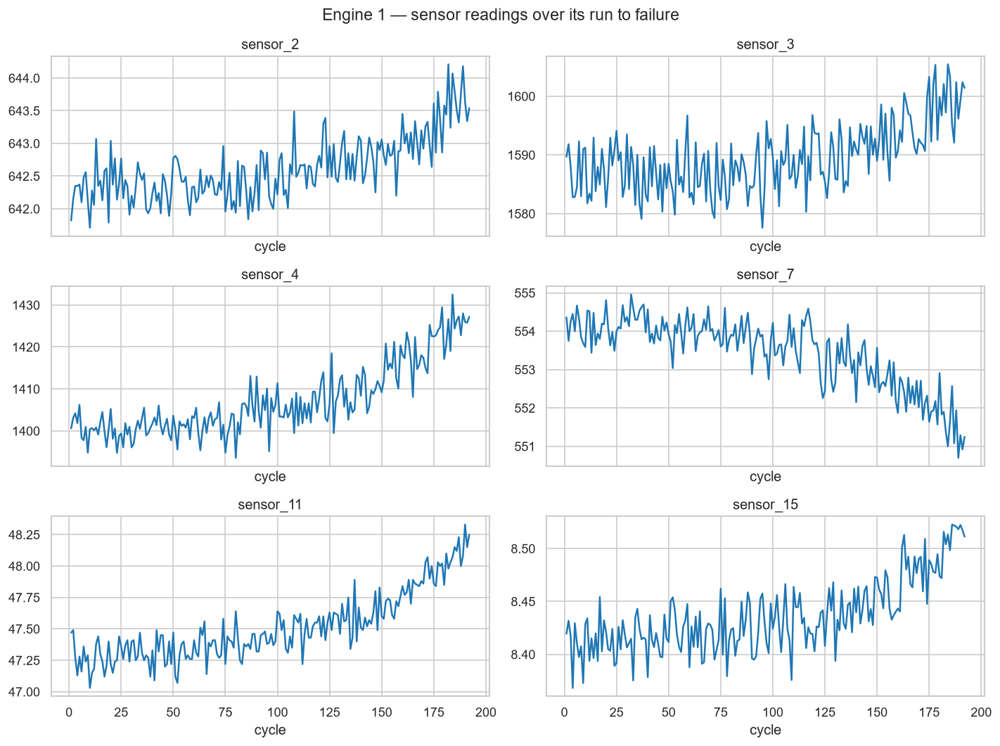
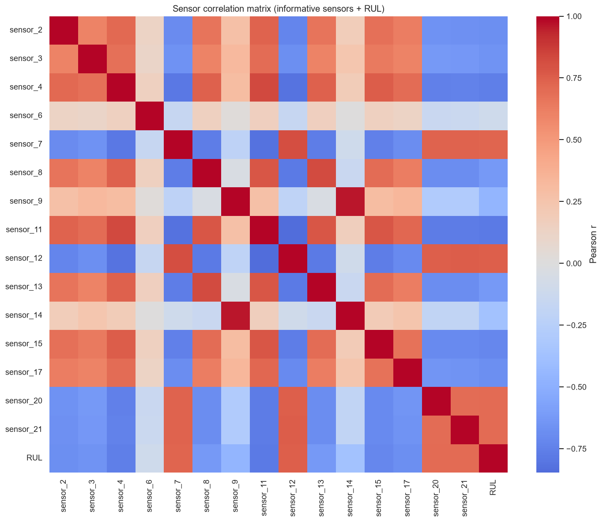
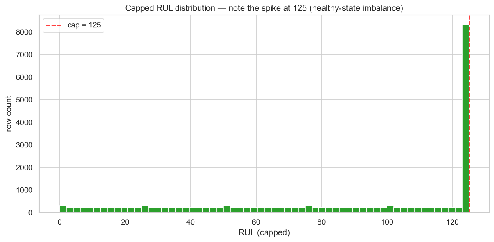
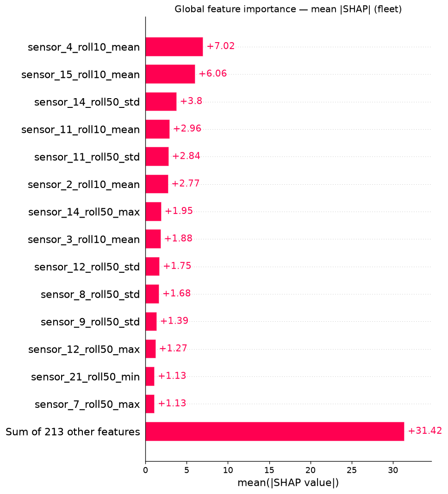
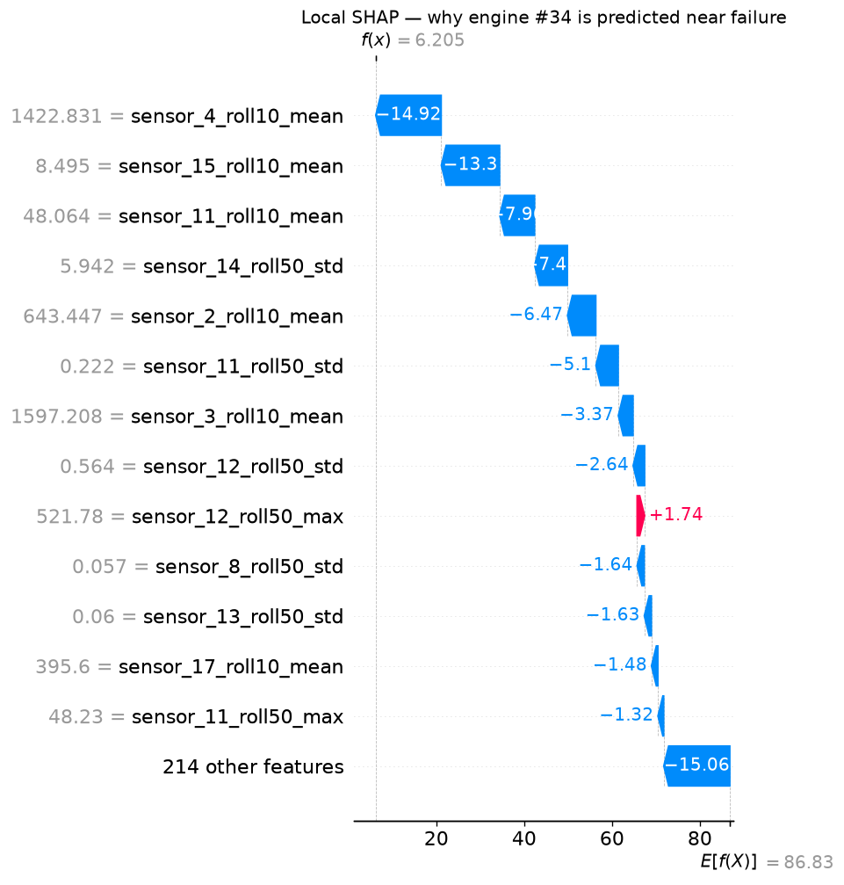

# ✈️ Prognostic Fleet Maintenance — Predicting Remaining Useful Life with Cost-Aware Modeling

Predicting the **Remaining Useful Life (RUL)** of turbofan engines from sensor
telemetry, on the NASA C-MAPSS **FD001** dataset — with the business asymmetry of
maintenance decisions baked into the metrics and the model selection, not bolted
on at the end.

> **Why this framing?** In predictive maintenance the two ways to be wrong are not
> equal. Servicing an engine a little early wastes a maintenance slot; letting one
> fail **in operation** is catastrophic. This project defines that cost asymmetry
> *first*, then optimises the model against it.

---

## Results at a glance

Held-out test set (100 engines, one prediction at each engine's last observed cycle):

| Model | RMSE ↓ | NASA/PHM08 score ↓ | Cost-sensitive MSE ↓ | Fleet cost ↓ | Missed failures ↓ |
|-------|:------:|:------------------:|:--------------------:|:------------:|:-----------------:|
| **XGBoost** (tuned on cost) | **14.51** | **417** | **1342** | **\$510k** | **4** |
| CNN-LSTM (raw windows) | 17.03 | 565 | 1906 | \$610k | 5 |

XGBoost wins on this small, single-operating-condition subset — reported honestly.
The CNN-LSTM is competitive while needing **zero hand-crafted features**, which is
its real advantage as the data grows messier (FD002–FD004).

**Business case vs. the no-prognostics status quo:** a run-to-failure policy pays
the ~\$100k unplanned-failure cost on all 25 truly-failing test engines ≈ **\$2.5M**.
The cost-aware XGBoost model brings total fleet cost to **\$510k — roughly an 80%
reduction** — by scheduling cheap planned maintenance on the engines that need it.

---

## Key plots

| Run-to-failure (engine 1) | Sensor correlations |
|---|---|
|  |  |

| Capped RUL distribution | Global SHAP importance |
|---|---|
|  |  |

Local explanation for the most urgent engine (#34, true RUL 7, predicted 6.2):



---

## The dataset

**NASA C-MAPSS Turbofan Engine Degradation Simulation — subset FD001.**
100 engines run to failure (train) and 100 truncated before failure (test), each
logged per operational cycle with 3 operational settings and 21 sensors. FD001 is
a single operating condition with a single fault mode (HPC degradation) — an ideal
scope for a focused, end-to-end project. `src/data.py` downloads the files from a
public mirror automatically (with manual-fallback instructions).

---

## Methodology (phase by phase)

1. **Data loading** — clean, named DataFrames (`src/data.py`).
2. **RUL targets** — linear RUL for train, then **piecewise-linear clipping at 125
   cycles** (Heimes 2008): an engine shows no measurable degradation until it nears
   failure, so flat-capping the early life removes an unlearnable, irrelevant signal.
   Test labels are reconstructed from `RUL_FD001.txt` (`src/targets.py`).
3. **EDA** — run-to-failure trajectories, correlation matrix, automatic dropping of
   7 constant sensors, RUL-distribution imbalance (`notebooks/01_eda.ipynb`).
4. **Feature engineering** — per-engine rolling stats (mean/std/min/max over
   windows 10/20/50), 1st & 2nd derivatives, lag(t-1). **All grouped by engine** so
   no window leaks across engine boundaries (`src/features.py`).
5. **Cost-aware metrics — defined before modelling** (`src/evaluation.py`):
   - **NASA/PHM08 score**: asymmetric piecewise-exponential (late errors divided by
     10, early by 13 → late hurts more).
   - **Cost-sensitive MSE**: late (over-)predictions weighted **10×**.
   - **Fleet business cost**: \$5k planned maintenance vs \$100k unplanned failure.
   - Exposed as sklearn `make_scorer`s so tuning optimises *cost*, not RMSE.
6. **XGBoost baseline** — randomised search with **GroupKFold by engine**, scored on
   cost-sensitive MSE (`src/model.py`).
7. **CNN-LSTM** — 1D-CNN feature extractor → LSTM over raw standardised sensor
   windows, no manual features (`src/cnn_lstm.py`).
8. **Explainability** — global + local SHAP on the XGBoost model (`src/explain.py`).
   The top drivers (rolling means of sensors 4/11/15) match the EDA correlations —
   independent methods agree, so the model learned real degradation physics.
9. **Streamlit demo** — pick an engine, see its sensors, a color-coded RUL alert, a
   plain-English business action, and the SHAP waterfall (`app/streamlit_app.py`).
10. **Tests + docs** — meaningful unit tests for the clipping and cost logic.

### Engineering note: a target-leakage bug, caught and documented
`normalized_life_position = cycle / max_cycle` is **target leakage** — `max_cycle`
is the failure cycle (future information), and it equals exactly `1.0` at every
truncated test engine's last cycle. A model that learned "life_position ≈ 1 → RUL ≈ 0"
predicted imminent failure for the entire fleet, collapsing test RMSE to ~73.
Caught because in-sample was perfect but test diverged. The feature is excluded
from the model (kept only for plots). See `add_normalized_life_position`.

---

## Run it locally

```bash
# 1. Install (Python 3.10–3.12, Poetry)
poetry install

# 2. Reproduce each phase (downloads the data on first run)
poetry run python src/data.py          # load + sanity-check
poetry run python src/targets.py       # RUL targets
poetry run python src/features.py      # feature matrix
poetry run python src/evaluation.py    # cost-metric demo
poetry run python src/model.py         # train + evaluate XGBoost
poetry run python src/cnn_lstm.py      # train + evaluate CNN-LSTM
poetry run python src/explain.py       # SHAP plots

# 3. Tests
poetry run pytest -q

# 4. Interactive demo
poetry run streamlit run app/streamlit_app.py
```

---

## Future work

- **Decision-threshold tuning** on `fleet_business_cost`: the 4 missed failures
  dominate cost; lowering the alert threshold trades cheap false alarms for fewer
  catastrophic misses — a direct sweep on the business objective.
- **Multi-dataset support (FD002–FD004)**: multiple operating conditions and fault
  modes, where the CNN-LSTM's learned features should close the gap on XGBoost.
- **Probabilistic RUL** (prediction intervals) for risk-aware scheduling.
- **Further CNN-LSTM tuning**: early stopping on a validation split, attention.

---

## Reference

A. Saxena, K. Goebel, D. Simon, N. Eklund, *"Damage Propagation Modeling for
Aircraft Engine Run-to-Failure Simulation,"* PHM 2008. NASA Prognostics Center of
Excellence (PCoE) Data Repository.
